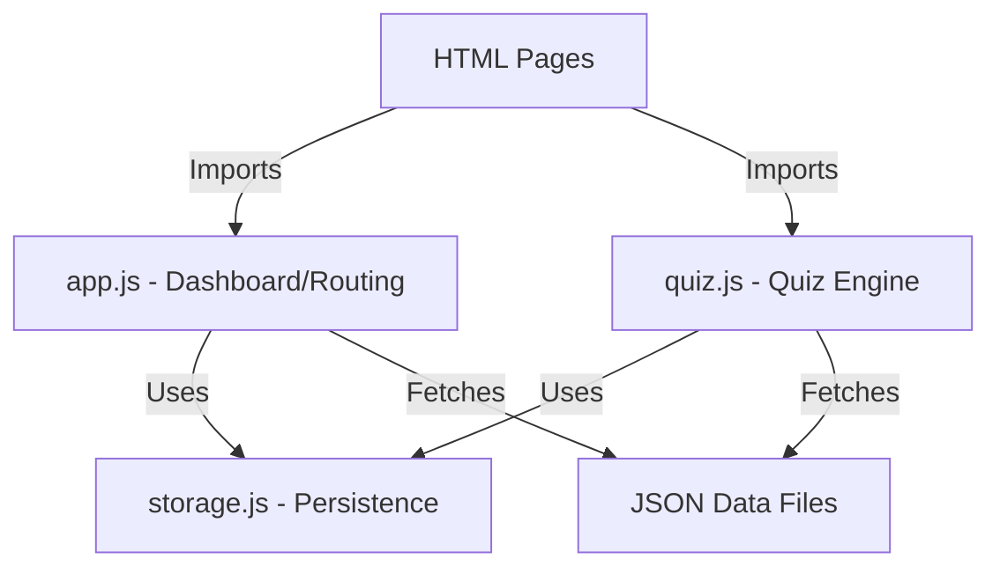

# JS Module Architecture - Thai Exam Hub

This document outlines the frontend architectural design for the Thai Exam Hub, utilizing native ES modules for a clean, maintainable, and dependency-free codebase.

## Overview

The application follows a modular architecture where each component has a single responsibility. We avoid complex bundlers or frameworks to ensure maximum performance and compatibility with GitHub Pages.

### Architecture Diagram

## Core Modules

### 1. `storage.js` (Persistence Layer)
- **Responsibility**: Abstracting `localStorage` interactions.
- **Key Features**:
    - JSON serialization/deserialization.
    - Versioned data schema to handle future updates.
    - Methods for:
        - `getHistory()`: Retrieve past quiz attempts.
        - `saveResult(examId, score, total)`: Persist quiz outcomes.
        - `getStreak()`: Calculate and retrieve daily usage streaks.
        - `updateStreak()`: Logic to increment or reset streaks based on last visit.
        - `getBookmarks()` / `toggleBookmark(id)`: Manage saved questions.

### 2. `quiz.js` (Quiz Engine)
- **Responsibility**: Managing the state machine of a quiz session.
- **Data Flow**:
    1. **Load**: Fetch exam JSON based on URL parameters.
    2. **Init**: Set up state (question index, empty answers array, start timer).
    3. **Interact**: User selects options, navigates through questions.
    4. **Submit**: Calculate final score and time spent.
    5. **Persist**: Write results to `storage.js`.
- **State Machine States**: `LOADING` -> `IN_PROGRESS` -> `REVIEW` -> `SUBMITTED`.

### 3. `app.js` (Dashboard & Orchestrator)
- **Responsibility**: Main entry point for the dashboard and common UI logic.
- **Tasks**:
    - Render subject list from `subjects.json`.
    - Populate dashboard metrics (total questions solved, current streak).
    - Handle navigation logic between main sections.
    - Global error handling for JSON loads.

## Data Flow: The "Thunder" Path

1. **JSON Load**: When a student selects an exam (e.g., `onet_math_2567`), `quiz.js` uses the native `fetch` API to load the corresponding JSON file from `/data/`.
2. **Quiz State Machine**: The `QuizEngine` class tracks user progress. It ensures that the UI stays in sync with the current question index and selected answers.
3. **Result Calculation**: Upon completion, the engine compares `userAnswers` with the `answer` field in the JSON data.
4. **LocalStorage Write**: Results are pushed to `storage.js`, which handles the write to `localStorage` under the key `thai_exam_hub_data`.

## Production Checklist

- [ ] Ensure `type="module"` is used in all `<script>` tags.
- [ ] Verify `UTF-8` encoding for all JSON files (essential for Thai characters).
- [ ] Validate `localStorage` quota usage (limit results history to 50 entries).
- [ ] Check mobile touch responsiveness for option selection.
- [ ] Test streak logic across different timezones.
